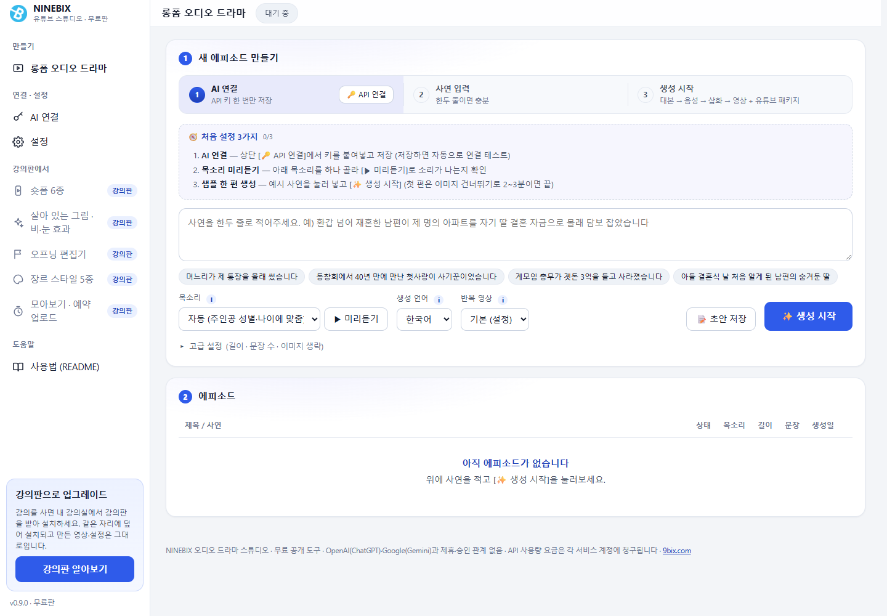

  

<h1 align="center">NINEBIX Audio Drama Studio</h1>

  <a href="README.md">한국어</a> · <b>English</b>

  One line of story → one finished audio-drama video. A Windows program that generates the script, narration, illustrations, subtitles, thumbnails and a YouTube upload package <b>with a single button</b>. 
  <b>Free · one installer · nothing else to install</b> 
  The latest free edition is <b>v0.9.0</b> (same features as v0.8.23 with a new look). New features continue in the <a href="#course-edition-ninebix-youtube-studio">course edition (NINEBIX YouTube Studio)</a>.

  
  
  
  

  

---

## Download

Get just one file, `AudioDramaStudio-Free-Setup-0.9.0.exe`, from **[Releases](../../releases/latest)** (up to v0.8.23 the file was named `AudioDramaStudio-Setup-<version>.exe`). Python, the TTS models, ffmpeg and fonts are all bundled, so there is nothing else to install.

- Windows 10/11 64-bit, about 2 GB of free disk space, an internet connection (for AI calls; the built-in voice synthesis works offline)
- **If you enable the optional AI voice engine (Qwen3-TTS):** NVIDIA GPU (6 GB+ VRAM, CUDA) recommended · 16 GB RAM · 10 GB more disk · about an 8 GB download. Without a GPU it runs on the CPU, but an 8-minute episode takes about 16 minutes. The default engine (Supertonic 3) runs on any PC without a GPU.
- The installer is not code-signed, so if SmartScreen warns you on first run, choose **More info → Run anyway**
- The license terms (license · third-party notices · disclaimer) are shown when installation starts; continuing the installation means you accept them
- To update, just run the new installer; it installs over the old one (settings and outputs are kept)
- Installing the course edition installs over the free edition in the same place, and your videos and settings are kept

## Course edition (NINEBIX YouTube Studio)

The free edition's features stopped at v0.8.23 (v0.9.0 only adds a new look), and all later development continues in the **course edition — NINEBIX YouTube Studio**. The free edition does not contain any course-edition code. The course edition is provided to students of the [sleepmoney YouTube automation course](https://api.9bix.com/courses?lang=en); the program and its license are free and only the course is paid (course sales and operation: sleepmoney / program development and copyright: NINEBIX Inc.).

| | Free edition v0.9.0 (this repository · features of v0.8.23) | Course edition (YouTube Studio) |
|---|---|---|
| Long-form audio drama | ○ | ○ + script continuity check · character sheets · re-generate only the line you edited |
| Living pictures (characters and background move separately, rain effect) | — | ○ |
| Shorts studio | — | 6 kinds (split · idea · story · shopping · article · your own photos & videos) + template editor |
| Voices | Supertonic 3 · Qwen3-TTS | + Gemini TTS, per-character voice design, voice library |
| Style profiles (genre · tone · art style) | — | ○ (senior stories · office life 20s–30s · mystery · romance · ghost stories + your own) |
| Channel operations | — | monthly planning · scheduled generation · automatic YouTube upload · compilations |
| Updates | No new features (re-run the installer) | Automatic updates for 1 year from purchase (from key registration for one-time keys) — keep using your last version after that |
| Upgrade | — | After buying the course, download it from My courses and install (installs over the free edition, keeps videos & settings) |
| Coupang banner | Yes | No |
| Requirements | Anyone | Google sign-in + license key, 1 account · 2 PCs |

- **Course info & sign-up:** <https://api.9bix.com/courses?lang=en>
- **Download (free & course editions):** <https://api.9bix.com/download> — the course-edition installer is available in [My courses](https://api.9bix.com/my) after you sign in with the account you paid with
- **Register a license key** (bought on Kmong, Inflearn, etc.): <https://api.9bix.com/redeem>
- **Program overview (company website):** <https://9bix.com/automation>

How to use the course edition and its release notes are in My courses on the course site and in the user manual inside the program.

## What it does

Give it one line of story (for example, *"My second husband secretly mortgaged the apartment in my name to pay for his daughter's wedding"*) and it automatically produces everything below, delivering a **final mp4 + three thumbnails + a YouTube upload package**. An 8-minute episode takes about 50 minutes (mostly illustration generation).

| Step | What happens |
|---|---|
| 1. Script | Outline → first-person narration per scene + re-enacted character dialogue (choose ChatGPT · Gemini · Claude) |
| 2. Voice | Per-sentence synthesis → voices matched automatically to each character's age and gender → loudness leveling and pitch-range correction → sound check. Narration and dialogue engines are chosen separately (bundled Supertonic 3 / optional Qwen3-TTS) |
| 3. Illustrations | About one image per 10 seconds, keeping characters and art style consistent with earlier results; the thumbnail portrait is made first |
| 4. Render | Opening card + slides + narration + sentence-timed subtitles + a looping clip in the corner → mp4, three thumbnails, YouTube package (titles · description · tags · chapters · SRT) |

### Key features

- **Connect with one key** — Paste an OpenAI, Gemini or Claude API key in **AI connection** and you are done. The script and illustration providers can be chosen separately (Claude is for scripts only). Keys are stored only on your PC and usage is billed to your own account (Gemini has a free quota).
- **Choice of voice engine** — The default is the bundled Supertonic 3 (offline, any PC). Install **Qwen3-TTS** in one step from Settings → Voice (about 8 GB, NVIDIA GPU recommended) to design voices from a character's gender, age and role for dialogue, or **clone your own voice for the narration from a 5–10 second recording**.
- **Voice quality correction** — Loudness is equalized sentence by sentence, the pitch range is adjusted to the character's age (so a 65-year-old man does not sound young), and lines that cut off or switch to a different voice are regenerated automatically.
- **Voice library** — Adjust a voice description, preview it and save it, and it is used automatically for the narrator (★ default) and for characters (matching name, gender and age band). Voices designed on the fly are saved too, so recurring characters keep the same voice across a series.
- **Opening** — A channel-name card and an opening narration ("This is ○○. Your subscriptions and likes mean a lot.") in the narrator's voice are added before the episode. You can upload a background photo, and subtitles, chapters and the SRT are shifted automatically.
- **Looping corner clip** — Upload live-action footage you shot and it loops in a small box in the top-left corner for the whole episode. This helps avoid YouTube's mass-produced / reused content classification; choose the clip per episode and re-render finished episodes with a different clip.
- **Three thumbnails** — One with the character portrait and the base headline, plus two more with different headlines and illustrations. Download each from the detail view.
- **YouTube upload package** — Three title candidates, a description (hook → synopsis → question → subscribe prompt + chapter timestamps + AI disclosure + hashtags), tags and an SRT subtitle file, ready to copy or download.
- **Subtitle fonts** — Pick from the fonts installed on this PC (also for thumbnail titles).
- **Languages** — The interface language is set in the Settings window, and the generation language (script · narration · subtitles · thumbnails) is chosen per episode. Korean, English, Japanese and Spanish.
- **Live generation log** — The outline, per-scene scripts, per-sentence voices, each image, rendering and thumbnails stream on screen in real time.
- **Sound safety checks** — Every sentence and every final file is checked for clipping, silence and noise; defects are corrected automatically and unusable results are blocked before rendering.
- **Background music & sound effects (optional)** — Off by default. Turn them on in Settings → Sound to fetch music that fits the scene mood and the sound effects the script calls for from Freesound.org (free API key required); if you allow CC-BY audio, credits for the description are generated automatically.

## Screens

  

The new v0.9.0 screen (Korean interface). Below is the v0.8.23 screen (same features).

  

  
  

  
  

## Get started in 3 steps

1. Run the installer and wait for the program to open (the first launch takes about a minute).
2. In the left menu, open **[AI connection]** (in v0.8.23 it is **[🔑 API 연결]** at the top) → choose the AI for scripts and illustrations, paste your API key and click **[Save]**. A connection test runs as soon as you save.
   - OpenAI key: https://platform.openai.com/api-keys · Gemini key: https://aistudio.google.com/apikey · Claude key: https://console.anthropic.com/settings/keys
3. In the left menu, open **[Settings]** → Opening and enter your **channel name**, then write a story and click **[✨ Start generating]**. When it finishes, play the video in the detail view on the right, then use **[⬇ Download video]**, the three thumbnails and **[📂 Open output folder]**.

If you widen the window to 1500 px or more, the left (input · list) and right (details) columns are shown side by side, and the episode list pages through three at a time.

## Main settings (⚙️ Settings)

| Tab | Items | Default |
|---|---|---|
| Script | Content language, drama tone & style guide, default target length, seconds per image | Korean · senior-story style · 480 s · 10 s |
| AI connection | Script/illustration provider, OpenAI · Gemini · Claude keys and models, image quality & resolution | ChatGPT · gpt-5-mini / gpt-image-1 |
| Voice | Narration/dialogue engine (Supertonic · Qwen), Qwen engine install, voice library, reading speed, synthesis quality, age-matching post-processing, automatic Qwen pitch-range correction | supertonic · 0.8 · 15 · on · on |
| Opening | Add opening, channel name, opening line, custom narration, background image (upload · preview) | on · (empty) · "구독과 좋아요는 큰 힘이 됩니다" |
| Overlay video | Loop-clip compositing, box size · margin · position · border, clip library (upload · set default) | on · 24% · 28 px · top-left |
| Sound | Background music, sound effects (Freesound key), volume | both off |
| Images | Image generation rules, fixed art style, camera motion | 1990s Korean TV drama realism · still |
| Subtitles & thumbnails | Subtitle burn-in · font (installed fonts) · size, automatic thumbnails · font · colors | on · per-language default font 58 px · white/purple |
| Folders | Voice · image · video · temp folders | `%APPDATA%\audio-drama\…` (set automatically) |

Change the interface language (Korean · English · Japanese · Spanish) at the top of the Settings window.

## FAQ

- **Does it cost anything?** The program is free. Only the OpenAI/Gemini/Claude API usage for scripts and illustrations is billed to your own account. Gemini has a free quota.
- **What is the banner shown when the app opens and closes?** It is a Coupang Partners banner that keeps the free distribution going. When you close the window, Coupang opens in your default browser after 5 seconds together with the banner, and then the program exits. As part of Coupang Partners activities, we receive a certain commission.
- **Where do I enter the channel name for the opening?** Settings → Opening → Channel name. If left empty, only the line is shown. In the same tab you can upload a background photo and check it with [Opening card preview].
- **What kind of clip should I upload for the loop video?** Any live-action video you shot (mp4/mov/webm). It is converted to 960×540 without audio and stored, and the first clip becomes the default. Use only footage you have the rights to.
- **It says the gpt-image model is not available.** OpenAI image models may require organization verification. Change the model name in Settings → AI connection, or use Gemini.
- **Where are the outputs saved?** Automatically under `C:\Users\<user>\AppData\Roaming\audio-drama` in `renders` (videos · thumbnails · YouTube txt), `tts` and `images`. Open the folder directly with [📂 Open output folder] in the detail view.
- **Does uninstalling remove everything?** Yes. Uninstalling the program deletes the folder above as well (including keys and outputs). Download the videos you need first.
- **Will it conflict with Python or ffmpeg I already have?** No. It uses only the copies bundled in the program folder. The Qwen engine is also installed only inside `%APPDATA%\audio-drama\engines\qwen3`.
- **Does Qwen3-TTS need a GPU?** With an NVIDIA GPU (6 GB+ VRAM) an 8-minute episode takes about 3 minutes; without one it runs on the CPU but takes about 16 minutes. The installer detects your GPU and tells you in advance. If you don't need it, just use Supertonic.
- **The dialogue voices sound younger than the characters.** Make sure "Qwen voice pitch-range correction" is on in Settings → Voice. It measures the designed voice's pitch and fits it to the target range for the character's age and gender.
- **How do I turn on background music and sound effects?** Get a free API key at https://freesound.org/apiv2/apply, save it in Settings → Sound, and turn on music/effects. By default only CC0 audio is used; if you allow CC-BY, the sources are listed in `renders/finals/<id>_credits.txt`.
- **How do I clone my own voice?** Record 5–10 seconds of wav in a quiet place, enter it and the sentence you spoke in Settings → Voice, and set the narration engine to qwen. Use only your own voice or a voice you have consent for.
- **Is it OK for YouTube monetization?** The licenses of the bundled and used components allow commercial use. However, YouTube's "mass-produced / repetitive content" policy and the disclosure rules for synthetic content must be followed by the channel operator. The loop clip and the opening help with this; turn on the "altered or synthetic content" label when uploading.

## Please read before use

- This program is an **unofficial tool distributed for free** and has no partnership with or endorsement from OpenAI (ChatGPT), Google (Gemini) or Anthropic (Claude). Each name is a trademark of its company.
- Scripts and illustrations are generated with **API keys you issue yourself**. Fees, limits and outages are matters of each service account, and NINEBIX is not involved.
- Use voice cloning **only for your own voice or the voice of someone who has explicitly consented**. You are responsible for any consequences of copying someone else's voice without permission.
- The program has **hidden advanced features** that use web pages you are signed in to (ChatGPT · Gemini) or the Claude Code session on this PC. Under those services' terms this may lead to account restrictions, so whether to use them and the results are your responsibility. The API-key method is recommended for normal use.
- Generated scripts, images and voices are AI output. Results may resemble real people or trademarks, so check them before publishing.
- Coupang Partners banner shown when the app starts and exits: **As part of Coupang Partners activities, we receive a certain commission.**

## Release notes

### v0.9.0 (2026-10-05) — new look · final tidy-up of the free edition

- **Features are the same as v0.8.23.** Only the look changed to the course edition's light theme and left menu.
- Left menu: long-form audio drama · AI connection · settings · how to use. Features that exist only in the course edition (6 kinds of Shorts · living pictures with rain & snow effects · opening editor · genre styles · compilations and scheduled upload) are only listed in the menu; clicking them opens the course page.
- **[Upgrade to the course edition]** — After buying the course, download the course edition from My courses and install it. It installs over the free edition and keeps your videos and settings.
- The installer is now named `AudioDramaStudio-Free-Setup-0.9.0.exe`. The install location and data folder are the same.
- The program's interface is in Korean by default; English and Spanish labels are included for the new menu.

### v0.8.23 (2026-09-30) — cumulative since v0.6.0

**New features**
- Opening: channel-name card + opening narration in the narrator's voice, background photo upload and preview. Automatic offset for subtitles, chapters and SRT.
- Looping corner clip (overlay): live-action clip library, per-episode choice, [🎞 Re-render] for finished episodes, size · position · border settings.
- Three YouTube thumbnails (different headlines and illustrations) + YouTube upload package (3 title candidates · description · chapters · tags · SRT · AI disclosure).
- Optional Qwen3-TTS engine (one-step install, GPU detection and requirements notice), separate narration/dialogue engines, voice library (design · recording clone · preview · auto-save), cloning your own voice for narration.
- Claude as a script provider, multilingual generation (KO · EN · JA · ES) + interface language switching, choosing subtitle and thumbnail fonts from the installed fonts.
- Background music & sound effects (Freesound, optional, off by default), crossfading music by scene mood.
- Dashboard redesign: two-column workbench on wide screens, episodes paged three at a time, draft saving · first-run checklist · progress board, custom title bar.
- Coupang Partners banner (pop-up on start · opens on exit).

**Voice quality**
- Loudness between sentences is equalized by RMS (previously up to 6 dB apart per sentence).
- Fixed sibilants (ㅅ/ㅆ) being mistaken for noise and suppressed. Age post-processing was replaced with a split-band method that leaves the breath band alone (removing tremble and high-frequency loss).
- Qwen dialogue: automatic anchor pitch-range correction (older characters coming out young), fixes for clipped sentence endings, automatic regeneration for voice switches, slurring and runaway output, redesign of abnormal anchors, final fallback to Supertonic.
- Fixed the script-provider choice being cleared at app start, silence before sigh lines, and a filter-order bug that made sigh lines silent.

**Thumbnails & rendering**
- Fixed thumbnail outlines breaking where strokes overlap (16-direction stroke). Excluded game/sci-fi style sound effects and limited the number of impacts.

**Stability**
- Fixed the Qwen engine install failing because of an offline flag, voice preview and save failures, and the script accordion, scroll position and description field resetting every 2 seconds.

### v0.6.0 (2026-09-29)
- First public free release: API keys by default, one-step installer (Electron), EULA and third-party notices.

## License

- Program: [End User License Agreement (EULA)](LICENSE) — free to use, free redistribution of the original installer allowed; sale, modification and reverse engineering prohibited. **Source code is not provided.**
- Bundled components follow their own licenses — [THIRD_PARTY_NOTICES.md](THIRD_PARTY_NOTICES.md). The bundled FFmpeg build is **GPL v3** (source: gyan.dev), the Supertonic 3 model is **OpenRAIL-M** (with use restrictions), and Black Han Sans is **SIL OFL**. The optionally installed Qwen3-TTS and PyTorch are **Apache-2.0** and **BSD-3** respectively. Freesound audio is CC0/CC BY per sound.
- Voice synthesis: [Supertonic 3](https://github.com/supertone-inc/supertonic) · [Qwen3-TTS](https://github.com/QwenLM/Qwen3-TTS) · Rendering: [FFmpeg](https://ffmpeg.org)

  © 2026 NINEBIX Inc. (주식회사 나인빅스) · <a href="https://9bix.com">9bix.com</a>

