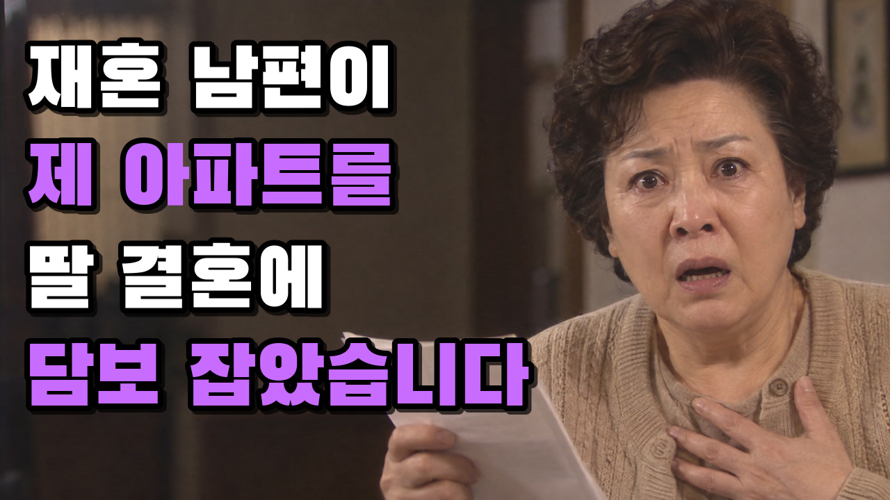

  

<h1 align="center">NINEBIX 오디오 드라마 스튜디오</h1>

  사연 한 줄 → 시니어 감성 썰 드라마 영상 한 편. 대본·나레이션·삽화·자막·썸네일까지 <b>버튼 하나로 자동 생성</b>하는 Windows 프로그램. 
  <b>무료 · 설치 파일 하나 · 사전 설치 없음</b>

  
  
  
  

  

---

## 다운로드

**[Releases](../../releases/latest)** 에서 `AudioDramaStudio-Setup-<버전>.exe` 하나만 받으면 됩니다. Python·TTS 모델·ffmpeg·폰트가 전부 들어 있어 따로 설치할 것이 없습니다.

- Windows 10/11 64비트, 디스크 여유 약 2GB, 인터넷(API 호출용 — 음성 합성은 오프라인)
- 코드 서명이 없어 첫 실행 시 SmartScreen 경고가 뜨면 **추가 정보 → 실행**
- 설치 시작 시 이용 약관(라이선스·서드파티·면책)이 표시되며, 설치를 진행하면 동의한 것으로 봅니다

## 무엇을 하는 프로그램인가

사연 한 줄(예: *"환갑 넘어 재혼한 남편이 제 명의 아파트를 자기 딸 결혼 자금으로 몰래 담보 잡았습니다"*)을 넣으면 아래를 전부 자동으로 만들어 **최종 mp4 + 유튜브 썸네일**을 내놓습니다.

| 단계 | 내용 |
|---|---|
| 1. 대본 | 아웃라인 → 장면별 1인칭 썰 나레이션 + 인물 대사 재연 (ChatGPT · Gemini · Claude 중 선택) |
| 2. 나레이션 | 문장별 음성 합성 → 인물 나이·성별에 맞춘 목소리 자동 배정 → 나이·감정 후처리 → 사운드 검사. 나레이션과 대사의 엔진을 따로 선택(동봉 Supertonic 3 / 선택 설치 Qwen3-TTS) |
| 3. 삽화 | 약 10초당 1장, 앞선 결과를 참고해 인물·화풍 유지, 썸네일용 인물 사진 먼저 |
| 4. 렌더 | 슬라이드 + 나레이션 + 문장 타이밍 자막 + 썸네일 합성 |

- **키 하나로 연결**: 상단 [🔑 API 연결]에 OpenAI·Gemini·Claude API 키를 붙여넣으면 끝. 대본과 삽화의 공급자를 따로 고를 수 있습니다(Claude 는 대본 전용). 키는 내 컴퓨터에만 저장되고 요금은 본인 계정에 청구됩니다(Gemini 는 무료 한도 있음).
- **목소리 엔진 선택**: 기본은 동봉된 Supertonic 3(오프라인, 모든 PC). 설정 → 음성에서 **Qwen3-TTS** 를 설치하면(약 7~9GB 다운로드, NVIDIA GPU 권장) 인물의 성별·나이·역할로 목소리를 설계해 대사에 쓰거나, **내 목소리 5~10초 녹음으로 나레이션을 클론**할 수 있습니다. 나레이션·대사 엔진은 각각 고릅니다.
- **실시간 생성 로그**: 아웃라인, 장면별 대본, 문장별 음성, 이미지 한 장씩, 렌더·썸네일까지 화면에서 실시간으로 흐릅니다.
- **사운드 안전장치**: 문장마다·최종 파일마다 포화/무음/잡음을 검사해 불량은 자동 보정하고, 못 쓰는 결과는 렌더 전에 막습니다.

## 화면

  

  
  

## 3단계로 시작하기

1. 설치 파일을 실행하고 프로그램이 열릴 때까지 기다립니다(첫 실행은 1분 정도).
2. 상단 **[🔑 API 연결]** → 대본/삽화에 쓸 AI 를 고르고 API 키를 붙여넣어 **[저장]**. 저장 즉시 연결 테스트가 돌아갑니다.
   - OpenAI 키: https://platform.openai.com/api-keys · Gemini 키: https://aistudio.google.com/apikey · Claude 키: https://console.anthropic.com/settings/keys
3. 사연을 적고 **[✨ 생성 시작]**. 완료되면 상세 화면에서 영상 재생, **[⬇ 영상 다운로드]**, **[📂 저장 폴더 열기]**.

## 주요 설정 (⚙️ 설정)

| 탭 | 항목 | 기본값 |
|---|---|---|
| 대본 | 드라마 톤·스타일 지침, 기본 목표 길이, 이미지 1장당 구간 | 시니어 썰 스타일 · 480초 · 10초 |
| AI 연결 | 대본/삽화 공급자, OpenAI·Gemini·Claude 키·모델, 이미지 품질·해상도 | ChatGPT · gpt-5-mini / gpt-image-1 |
| 음성 | 나레이션/대사 엔진(Supertonic·Qwen), Qwen 엔진 설치, 내 목소리 참고 wav, 낭독 속도, 합성 품질, 나이 맞춤 후처리 | supertonic · 0.8 · 15 · 켬 |
| 이미지 | 이미지 생성 규칙, 고정 화풍, 화면 움직임 | 90년대 한국 TV 드라마 실사 · 정지 |
| 자막·썸네일 | 자막 번인·폰트·크기, 썸네일 자동 생성·색 | 켬 · Malgun Gothic 58px · 흰/보라 |
| 저장 폴더 | 음성·이미지·영상·임시 폴더 | `%APPDATA%\audio-drama\…` (자동 설정, 바꿀 필요 없음) |

## 자주 묻는 질문

- **요금이 드나요?** 프로그램은 무료입니다. 대본·삽화 생성에 쓰는 OpenAI/Gemini/Claude API 사용량만 본인 계정에 청구됩니다. Gemini 는 무료 한도가 있습니다.
- **gpt-image 모델이 목록에 없다고 나와요.** OpenAI 이미지 모델은 조직 인증이 필요할 수 있습니다. 설정 → AI 연결에서 다른 모델명으로 바꾸거나 Gemini 를 쓰세요.
- **산출물은 어디에 저장되나요?** `C:\Users\<사용자>\AppData\Roaming\audio-drama` 아래 `renders`(영상·썸네일)·`tts`·`images` 에 자동으로 저장됩니다. 상세 화면의 [📂 저장 폴더 열기]로 바로 열 수 있습니다.
- **삭제하면 깨끗이 지워지나요?** 네. 프로그램 제거 시 위 폴더(키·산출물 포함)가 함께 삭제됩니다. 필요한 영상은 먼저 다운로드해 두세요.
- **기존에 설치된 Python·ffmpeg 와 충돌하나요?** 아니요. 모두 프로그램 폴더 안의 동봉본만 사용합니다. Qwen 엔진도 `%APPDATA%\audio-drama\engines\qwen3` 안에만 설치됩니다.
- **Qwen3-TTS 는 GPU 가 꼭 필요한가요?** NVIDIA GPU(VRAM 6GB 이상)면 8분 분량을 약 3분에 만들고, 없으면 CPU 로 동작하지만 약 16분 걸립니다. 필요 없으면 Supertonic 만 쓰면 됩니다.
- **내 목소리 클론은 어떻게 하나요?** 조용한 곳에서 5~10초 녹음한 wav 와 그때 말한 문장을 설정 → 음성에 넣고 나레이션 엔진을 qwen 으로 두면 됩니다. 본인 또는 동의받은 목소리만 사용하세요.

## 이용 전 꼭 읽어주세요

- 이 프로그램은 **무료 배포되는 비공식 도구**이며 OpenAI(ChatGPT)·Google(Gemini)·Anthropic(Claude)과 제휴·승인 관계가 없습니다. 각 명칭은 해당 회사의 상표입니다.
- 대본·삽화는 **사용자가 직접 발급한 API 키**로 생성됩니다. 요금·한도·장애는 각 서비스 계정의 문제이며 나인빅스가 관여하지 않습니다.
- 보이스 클론은 **본인 또는 명시적으로 동의한 사람의 목소리**에만 사용하세요. 타인의 목소리를 무단 복제해 생기는 책임은 사용자에게 있습니다.
- 프로그램에는 본인이 로그인한 웹 화면을 브라우저로 자동 조작하는 **숨김 고급 기능**이 있습니다. 해당 서비스 약관상 계정 제한 등 불이익이 생길 수 있으므로 사용 여부와 결과에 대한 책임은 사용자에게 있습니다.
- 생성된 대본·이미지·음성은 AI 산출물입니다. 실존 인물·상표를 연상시키는 결과가 나올 수 있으니 게시 전 확인하세요.

## 라이선스

- 프로그램: [최종 사용자 라이선스(EULA)](LICENSE) — 무료 사용, 원본 설치 파일의 무료 재배포 허용, 판매·수정·리버스 엔지니어링 금지. **소스 코드는 제공되지 않습니다.**
- 동봉 구성요소는 각자의 라이선스를 따릅니다 — [THIRD_PARTY_NOTICES.md](THIRD_PARTY_NOTICES.md). FFmpeg 동봉 빌드는 **GPL v3**(소스: gyan.dev), Supertonic 3 모델은 **OpenRAIL-M**(사용 제한 조항 있음), Black Han Sans 는 **SIL OFL**. 선택 설치되는 Qwen3-TTS 와 PyTorch 는 각각 **Apache-2.0**, **BSD-3**.
- 음성 합성: [Supertonic 3](https://github.com/supertone-inc/supertonic) · 렌더: [FFmpeg](https://ffmpeg.org)

  © 2026 NINEBIX (주식회사 나인빅스) · <a href="https://9bix.com">9bix.com</a>

