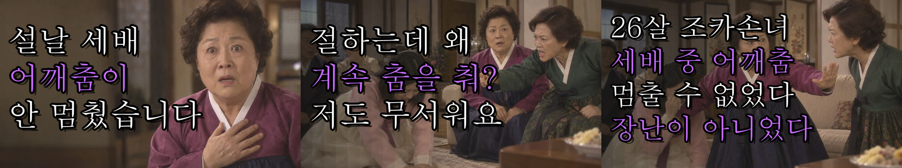
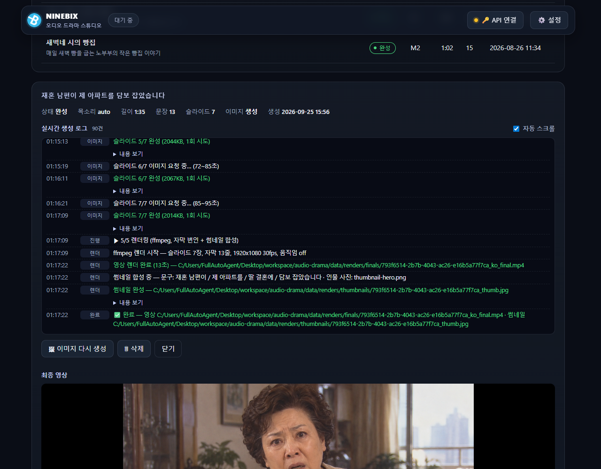
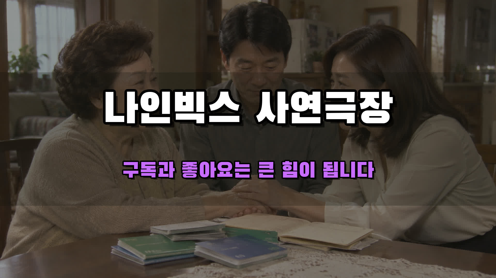
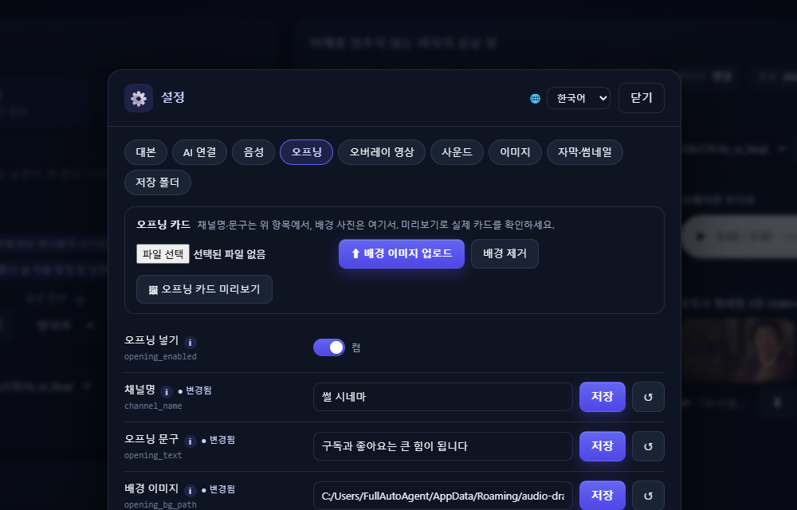
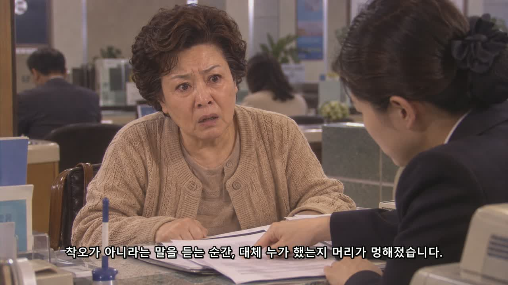
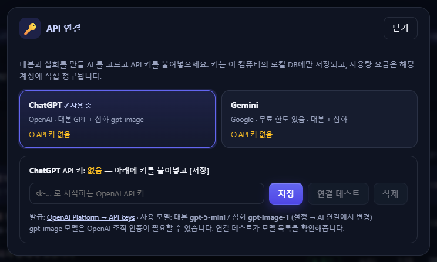

  

<h1 align="center">NINEBIX 오디오 드라마 스튜디오</h1>

  사연 한 줄 → 시니어 감성 썰 드라마 영상 한 편. 대본·나레이션·삽화·자막·썸네일·유튜브 업로드 패키지까지 <b>버튼 하나로 자동 생성</b>하는 Windows 프로그램. 
  <b>무료 · 설치 파일 하나 · 사전 설치 없음</b> 
  무료판은 v0.8.23 이 마지막입니다. 이후 개발은 <a href="#강의판-ninebix-유튜브-스튜디오">강의판(NINEBIX 유튜브 스튜디오)</a>으로 이어집니다.

  
  
  
  

  

---

## 다운로드

**[Releases](../../releases/latest)** 에서 `AudioDramaStudio-Setup-<버전>.exe` 하나만 받으면 됩니다. Python·TTS 모델·ffmpeg·폰트가 전부 들어 있어 따로 설치할 것이 없습니다.

- Windows 10/11 64비트, 디스크 여유 약 2GB, 인터넷(AI 호출용 — 기본 음성 합성은 오프라인)
- **선택 AI 음성 엔진(Qwen3-TTS)을 켤 경우**: NVIDIA GPU(VRAM 6GB 이상, CUDA) 권장 · RAM 16GB · 디스크 10GB 추가 · 다운로드 약 8GB. GPU 가 없으면 CPU 로 동작하지만 8분 분량에 약 16분이 걸립니다. 기본 엔진(Supertonic 3)은 GPU 없이 모든 PC 에서 동작합니다.
- 코드 서명이 없어 첫 실행 시 SmartScreen 경고가 뜨면 **추가 정보 → 실행**
- 설치 시작 시 이용 약관(라이선스·서드파티·면책)이 표시되며, 설치를 진행하면 동의한 것으로 봅니다
- 새 버전은 설치 파일을 그대로 다시 실행하면 덮어쓰기됩니다(설정·산출물 유지)

## 강의판 (NINEBIX 유튜브 스튜디오)

무료판(v0.8.23)은 여기서 멈추고, 그 뒤의 모든 개발은 **강의판 — NINEBIX 유튜브 스튜디오**로 이어졌습니다. 강의판은 [sleepmoney 유튜브 자동화 강의](https://api.9bix.com/courses) 수강생에게 제공되며, 프로그램과 라이선스는 무료이고 강의만 유료입니다(강의 판매·운영: sleepmoney / 프로그램 개발·저작권: 주식회사 나인빅스).

| | 무료판 v0.8.23 (이 저장소) | 강의판 (유튜브 스튜디오) |
|---|---|---|
| 롱폼 오디오 드라마 | ○ | ○ + 대본 연속성 검사 · 인물 시트 · 대사 한 줄 수정 후 부분 재생성 |
| 살아 있는 그림(인물·배경 따로 움직임, 비 효과) | — | ○ |
| 숏폼 스튜디오 | — | 6종 (영상 분할 · 아이디어형 · 썰 · 쇼핑 · 글 · 내 사진·영상) + 템플릿 편집기 |
| 목소리 | Supertonic 3 · Qwen3-TTS | + Gemini TTS, 인물별 목소리 설계, 보이스 라이브러리 |
| 스타일 프로필(장르·톤·화풍) | — | ○ (시니어 썰 · 2030 직장 · 미스터리 · 로맨스 · 괴담 + 직접 만들기) |
| 운영 | — | 한 달 기획 · 예약 생성 · 유튜브 자동 업로드 · 모아보기 |
| 업데이트 | 설치 파일 다시 실행 | 자동 업데이트(바뀐 부분만 받음) |
| 쿠팡 배너 | 있음 | 없음 |
| 사용 조건 | 누구나 | Google 로그인 + 라이선스 키, 계정 1개 · PC 2대 |

- **강의 소개 · 신청:** <https://api.9bix.com/courses>
- **프로그램 받기(무료판 · 강의판):** <https://api.9bix.com/download> — 강의판 설치 파일은 결제한 계정으로 로그인한 뒤 [내 강의실](https://api.9bix.com/my)에서 받습니다
- **라이선스 키 등록**(크몽·인프런 등에서 산 키): <https://api.9bix.com/redeem>
- **프로그램 소개(회사 홈페이지):** <https://9bix.com/automation>

강의판 사용법과 업데이트 내역은 강의 사이트 내 강의실과 프로그램 안의 사용 설명서에 있습니다.

## 무엇을 하는 프로그램인가

사연 한 줄(예: *"환갑 넘어 재혼한 남편이 제 명의 아파트를 자기 딸 결혼 자금으로 몰래 담보 잡았습니다"*)을 넣으면 아래를 전부 자동으로 만들어 **최종 mp4 + 썸네일 3종 + 유튜브 업로드 패키지**를 내놓습니다. 8분 분량 기준 약 50분(대부분 삽화 생성 시간)이 걸립니다.

| 단계 | 내용 |
|---|---|
| 1. 대본 | 아웃라인 → 장면별 1인칭 썰 나레이션 + 인물 대사 재연 (ChatGPT · Gemini · Claude 중 선택) |
| 2. 음성 | 문장별 합성 → 인물 나이·성별에 맞춘 목소리 자동 배정 → 음량 균일화·음역 보정 → 사운드 검사. 나레이션과 대사 엔진을 따로 선택(동봉 Supertonic 3 / 선택 설치 Qwen3-TTS) |
| 3. 삽화 | 약 10초당 1장, 앞선 결과를 참고해 인물·화풍 유지, 썸네일용 인물 사진 먼저 |
| 4. 렌더 | 오프닝 카드 + 슬라이드 + 나레이션 + 문장 타이밍 자막 + 화면 구석 반복 영상 → mp4, 썸네일 3종, 유튜브 패키지(제목·설명·태그·챕터·SRT) |

### 핵심 기능

- **키 하나로 연결** — 상단 [🔑 API 연결]에 OpenAI·Gemini·Claude API 키를 붙여넣으면 끝. 대본과 삽화의 공급자를 따로 고를 수 있습니다(Claude 는 대본 전용). 키는 내 컴퓨터에만 저장되고 요금은 본인 계정에 청구됩니다(Gemini 는 무료 한도 있음).
- **목소리 엔진 선택** — 기본은 동봉된 Supertonic 3(오프라인, 모든 PC). 설정 → 음성에서 **Qwen3-TTS** 를 한 번에 설치하면(약 8GB, NVIDIA GPU 권장) 인물의 성별·나이·역할로 목소리를 설계해 대사에 쓰거나, **내 목소리 5~10초 녹음으로 나레이션을 클론**할 수 있습니다.
- **목소리 품질 보정** — 문장마다 음량을 같게 맞추고, 인물 나이에 맞는 음역으로 자동 조정하며(65세 남성이 젊은 목소리로 나오는 일 방지), 대사가 끊기거나 같은 인물이 다른 목소리로 튀면 자동으로 다시 만듭니다.
- **보이스 라이브러리** — 설계문을 조절해 미리 듣고 저장하면 나레이터(★기본)와 인물(이름·성별·나이대 일치)에 자동으로 들어갑니다. 즉석 설계된 인물 목소리도 자동 저장돼 시리즈물에서 같은 인물은 같은 목소리를 유지합니다.
- **오프닝** — 본편 앞에 채널명 카드 + "○○입니다. 구독과 좋아요는 큰 힘이 됩니다." 나레이션(나레이터와 같은 목소리)이 붙습니다. 배경 사진을 올릴 수 있고 자막·챕터·SRT 는 자동으로 맞춰집니다.
- **화면 구석 반복 영상** — 직접 촬영한 실사 영상을 올려 두면 화면 왼쪽 위 작은 박스에 본편 내내 반복 재생됩니다. 유튜브의 대량 생산·재사용 콘텐츠 분류를 피하기 위한 기능으로, 에피소드마다 어떤 영상을 쓸지 고르고 완성된 편도 다른 영상으로 다시 렌더할 수 있습니다.
- **썸네일 3종** — 인물 사진 + 기본 문구 1장, 다른 문구·다른 삽화로 2장을 더 만듭니다. 상세 화면에서 각각 내려받습니다.
- **유튜브 업로드 패키지** — 제목 후보 3개, 설명(훅 → 줄거리 → 질문 → 구독 유도 + 챕터 타임스탬프 + AI 제작 고지 + 해시태그), 태그, 자막 SRT 를 자동 생성해 복사·다운로드할 수 있습니다.
- **자막 폰트** — 이 PC 에 설치된 폰트 목록에서 고릅니다(썸네일 제목 폰트도).
- **언어** — 화면(UI) 언어는 설정 창에서, 생성 언어(대본·나레이션·자막·썸네일)는 에피소드를 만들 때 고릅니다. 한국어·영어·일본어·스페인어.
- **실시간 생성 로그** — 아웃라인, 장면별 대본, 문장별 음성, 이미지 한 장씩, 렌더·썸네일까지 화면에서 실시간으로 흐릅니다.
- **사운드 안전장치** — 문장마다·최종 파일마다 포화/무음/잡음을 검사해 불량은 자동 보정하고, 못 쓰는 결과는 렌더 전에 막습니다.
- **배경음악·효과음(선택)** — 기본은 꺼져 있습니다. 설정 → 사운드에서 켜면 Freesound.org(무료 API 키 필요)에서 장면 분위기에 맞는 곡과 대본이 정한 효과음을 찾아 넣고, CC-BY 음원을 허용하면 설명란용 크레딧을 자동 생성합니다.

## 화면

  

  
  

  
  

## 3단계로 시작하기

1. 설치 파일을 실행하고 프로그램이 열릴 때까지 기다립니다(첫 실행은 1분 정도).
2. 상단 **[🔑 API 연결]** → 대본/삽화에 쓸 AI 를 고르고 API 키를 붙여넣어 **[저장]**. 저장 즉시 연결 테스트가 돌아갑니다.
   - OpenAI 키: https://platform.openai.com/api-keys · Gemini 키: https://aistudio.google.com/apikey · Claude 키: https://console.anthropic.com/settings/keys
3. 설정 → 오프닝에 **채널명**을 넣고, 사연을 적어 **[✨ 생성 시작]**. 완료되면 오른쪽 상세에서 영상 재생, **[⬇ 영상 다운로드]**, 썸네일 3종, **[📂 저장 폴더 열기]**.

창을 1500px 이상으로 넓히면 왼쪽(입력·목록)과 오른쪽(상세) 2열로 표시되고, 에피소드 목록은 3개씩 페이지로 넘깁니다.

## 주요 설정 (⚙️ 설정)

| 탭 | 항목 | 기본값 |
|---|---|---|
| 대본 | 콘텐츠 언어, 드라마 톤·스타일 지침, 기본 목표 길이, 이미지 1장당 구간 | 한국어 · 시니어 썰 스타일 · 480초 · 10초 |
| AI 연결 | 대본/삽화 공급자, OpenAI·Gemini·Claude 키·모델, 이미지 품질·해상도 | ChatGPT · gpt-5-mini / gpt-image-1 |
| 음성 | 나레이션/대사 엔진(Supertonic·Qwen), Qwen 엔진 설치, 보이스 라이브러리, 낭독 속도, 합성 품질, 나이 맞춤 후처리, Qwen 음역 자동 보정 | supertonic · 0.8 · 15 · 켬 · 켬 |
| 오프닝 | 오프닝 넣기, 채널명, 오프닝 문구, 나레이션 직접 지정, 배경 이미지(업로드·미리보기) | 켬 · (비움) · "구독과 좋아요는 큰 힘이 됩니다" |
| 오버레이 영상 | 반복 영상 합성, 박스 크기·여백·위치·테두리, 영상 라이브러리(업로드·기본 지정) | 켬 · 24% · 28px · 왼쪽 위 |
| 사운드 | 배경음악, 효과음(Freesound 키), 음량 | 둘 다 꺼짐 |
| 이미지 | 이미지 생성 규칙, 고정 화풍, 화면 움직임 | 90년대 한국 TV 드라마 실사 · 정지 |
| 자막·썸네일 | 자막 번인·폰트(설치된 폰트 목록)·크기, 썸네일 자동 생성·폰트·색 | 켬 · 언어별 기본 폰트 58px · 흰/보라 |
| 저장 폴더 | 음성·이미지·영상·임시 폴더 | `%APPDATA%\audio-drama\…` (자동 설정) |

화면 언어(한국어·영어·일본어·스페인어)는 설정 창 머리에서 바꿉니다.

## 자주 묻는 질문

- **요금이 드나요?** 프로그램은 무료입니다. 대본·삽화 생성에 쓰는 OpenAI/Gemini/Claude API 사용량만 본인 계정에 청구됩니다. Gemini 는 무료 한도가 있습니다.
- **앱을 켜고 끌 때 뜨는 배너는 뭔가요?** 쿠팡 파트너스 배너입니다. 무료 배포를 유지하기 위한 것으로, 창을 닫으면 배너와 함께 5초 뒤 기본 브라우저에서 쿠팡이 열린 다음 프로그램이 종료됩니다. 쿠팡 파트너스 활동의 일환으로, 이에 따른 일정액의 수수료를 제공받습니다.
- **오프닝의 채널명은 어디서 넣나요?** 설정 → 오프닝 → 채널명. 비워 두면 문구만 나옵니다. 같은 탭에서 배경 사진을 올리고 [오프닝 카드 미리보기]로 확인할 수 있습니다.
- **반복 영상은 어떤 걸 올리나요?** 직접 촬영한 실사 영상(mp4/mov/webm)이면 됩니다. 올리면 960×540·무음으로 정리돼 보관되고, 첫 영상이 기본 클립이 됩니다. 저작권이 확보된 영상만 쓰세요.
- **gpt-image 모델이 목록에 없다고 나와요.** OpenAI 이미지 모델은 조직 인증이 필요할 수 있습니다. 설정 → AI 연결에서 다른 모델명으로 바꾸거나 Gemini 를 쓰세요.
- **산출물은 어디에 저장되나요?** `C:\Users\<사용자>\AppData\Roaming\audio-drama` 아래 `renders`(영상·썸네일·유튜브 txt)·`tts`·`images` 에 자동으로 저장됩니다. 상세 화면의 [📂 저장 폴더 열기]로 바로 열 수 있습니다.
- **삭제하면 깨끗이 지워지나요?** 네. 프로그램 제거 시 위 폴더(키·산출물 포함)가 함께 삭제됩니다. 필요한 영상은 먼저 다운로드해 두세요.
- **기존에 설치된 Python·ffmpeg 와 충돌하나요?** 아니요. 모두 프로그램 폴더 안의 동봉본만 사용합니다. Qwen 엔진도 `%APPDATA%\audio-drama\engines\qwen3` 안에만 설치됩니다.
- **Qwen3-TTS 는 GPU 가 꼭 필요한가요?** NVIDIA GPU(VRAM 6GB 이상)면 8분 분량을 약 3분에 만들고, 없으면 CPU 로 동작하지만 약 16분 걸립니다. 설치 화면이 GPU 를 감지해 미리 알려줍니다. 필요 없으면 Supertonic 만 쓰면 됩니다.
- **대사 목소리가 인물 나이보다 젊게 들려요.** 설정 → 음성의 "Qwen 목소리 음역 자동 보정"이 켜져 있는지 확인하세요. 설계된 목소리의 높낮이를 재서 나이·성별 목표 음역으로 맞춥니다.
- **배경음악·효과음은 어떻게 켜나요?** https://freesound.org/apiv2/apply 에서 무료 API 키를 받아 설정 → 사운드에 저장하고 배경음악/효과음을 켜면 됩니다. 기본은 CC0 음원만 쓰고, CC-BY 를 허용하면 `renders/finals/<id>_credits.txt` 에 출처가 정리됩니다.
- **내 목소리 클론은 어떻게 하나요?** 조용한 곳에서 5~10초 녹음한 wav 와 그때 말한 문장을 설정 → 음성에 넣고 나레이션 엔진을 qwen 으로 두면 됩니다. 본인 또는 동의받은 목소리만 사용하세요.
- **유튜브 수익화에 문제는 없나요?** 동봉·사용하는 구성요소의 라이선스는 상업적 이용을 허용합니다. 다만 유튜브의 "대량 생산·반복 콘텐츠" 정책과 합성 콘텐츠 공개 표시 규정은 채널 운영자가 직접 지켜야 합니다. 반복 영상과 오프닝은 그 부담을 줄이기 위한 기능이며, 업로드 시 "변경 또는 합성된 콘텐츠" 표시를 켜세요.

## 이용 전 꼭 읽어주세요

- 이 프로그램은 **무료 배포되는 비공식 도구**이며 OpenAI(ChatGPT)·Google(Gemini)·Anthropic(Claude)과 제휴·승인 관계가 없습니다. 각 명칭은 해당 회사의 상표입니다.
- 대본·삽화는 **사용자가 직접 발급한 API 키**로 생성됩니다. 요금·한도·장애는 각 서비스 계정의 문제이며 나인빅스가 관여하지 않습니다.
- 보이스 클론은 **본인 또는 명시적으로 동의한 사람의 목소리**에만 사용하세요. 타인의 목소리를 무단 복제해 생기는 책임은 사용자에게 있습니다.
- 프로그램에는 본인이 로그인한 웹 화면(ChatGPT·Gemini)이나 이 PC 의 Claude Code 세션을 이용하는 **숨김 고급 기능**이 있습니다. 해당 서비스 약관상 계정 제한 등 불이익이 생길 수 있으므로 사용 여부와 결과에 대한 책임은 사용자에게 있습니다. 일반 사용은 API 키 방식을 권장합니다.
- 생성된 대본·이미지·음성은 AI 산출물입니다. 실존 인물·상표를 연상시키는 결과가 나올 수 있으니 게시 전 확인하세요.
- 앱 시작·종료 시 표시되는 쿠팡 파트너스 배너: **쿠팡 파트너스 활동의 일환으로, 이에 따른 일정액의 수수료를 제공받습니다.**

## 업데이트 내역

### v0.8.23 (2026-09-30) — v0.6.0 이후 누적

**새 기능**
- 오프닝: 채널명 카드 + 나레이터 목소리의 오프닝 나레이션, 배경 사진 업로드·미리보기. 자막·챕터·SRT 자동 오프셋.
- 화면 구석 반복 영상(오버레이): 실사 영상 라이브러리, 에피소드별 선택, 완성 편 [🎞 다시 렌더], 크기·위치·테두리 설정.
- 유튜브 썸네일 3종(문구·삽화 다르게) + 유튜브 업로드 패키지(제목 후보 3·설명·챕터·태그·SRT·AI 고지).
- Qwen3-TTS 선택 엔진(원스텝 설치, GPU 감지·사양 안내), 나레이션/대사 엔진 분리, 보이스 라이브러리(설계·녹음 클론·미리듣기·자동 저장), 내 목소리 나레이션 클론.
- Claude 대본 공급자, 다국어 생성(한·영·일·서) + 화면 언어 전환, 설치된 폰트 목록에서 자막·썸네일 폰트 선택.
- 배경음악·효과음(Freesound, 선택·기본 꺼짐), 장면 분위기별 곡 교차.
- 대시보드 개편: 넓은 화면 2열 작업대, 에피소드 3개씩 페이징, 초안 저장·첫 실행 체크리스트·진행판, 커스텀 상단바.
- 쿠팡 파트너스 배너(시작 팝업·종료 시 자동 이동).

**목소리 품질**
- 문장 간 음량을 RMS 기준으로 균일화(이전엔 문장마다 최대 6dB 차이).
- 치찰음(ㅅ/ㅆ)을 잡음으로 오인해 눌러 버리던 문제 수정. 나이 후처리는 숨소리 대역을 건드리지 않는 분할 대역 방식으로 교체(떨림·고음 감쇠 제거).
- Qwen 대사: 앵커 음역 자동 보정(노년 인물이 젊게 나오던 문제), 문장 끝 잘림 대책, 목소리 튐·씹힘·폭주 자동 재생성, 비정상 앵커 재설계, 최종 Supertonic 대체.
- 앱 기동 시 대본 공급자 선택이 지워지던 버그, 한숨 대사 앞 묵음, 한숨 대사가 무음으로 나오던 필터 순서 버그 수정.

**썸네일·렌더**
- 썸네일 외곽선이 획 겹침에서 끊기던 문제 수정(16방향 스트로크). 효과음 게임·SF 계열 제외, 임팩트 횟수 제한.

**안정성**
- Qwen 엔진 설치가 오프라인 플래그 때문에 실패하던 문제, 보이스 미리듣기·저장 실패, 대본 아코디언·스크롤·설명 칸이 2초마다 초기화되던 문제 수정.

### v0.6.0 (2026-09-29)
- 무료 공개판 첫 릴리즈: API 키 기본, 설치형(Electron) 원스텝, EULA·서드파티 고지.

## 라이선스

- 프로그램: [최종 사용자 라이선스(EULA)](LICENSE) — 무료 사용, 원본 설치 파일의 무료 재배포 허용, 판매·수정·리버스 엔지니어링 금지. **소스 코드는 제공되지 않습니다.**
- 동봉 구성요소는 각자의 라이선스를 따릅니다 — [THIRD_PARTY_NOTICES.md](THIRD_PARTY_NOTICES.md). FFmpeg 동봉 빌드는 **GPL v3**(소스: gyan.dev), Supertonic 3 모델은 **OpenRAIL-M**(사용 제한 조항 있음), Black Han Sans 는 **SIL OFL**. 선택 설치되는 Qwen3-TTS 와 PyTorch 는 각각 **Apache-2.0**, **BSD-3**. Freesound 음원은 음원별 CC0/CC BY.
- 음성 합성: [Supertonic 3](https://github.com/supertone-inc/supertonic) · [Qwen3-TTS](https://github.com/QwenLM/Qwen3-TTS) · 렌더: [FFmpeg](https://ffmpeg.org)

  © 2026 NINEBIX (주식회사 나인빅스) · <a href="https://9bix.com">9bix.com</a>

